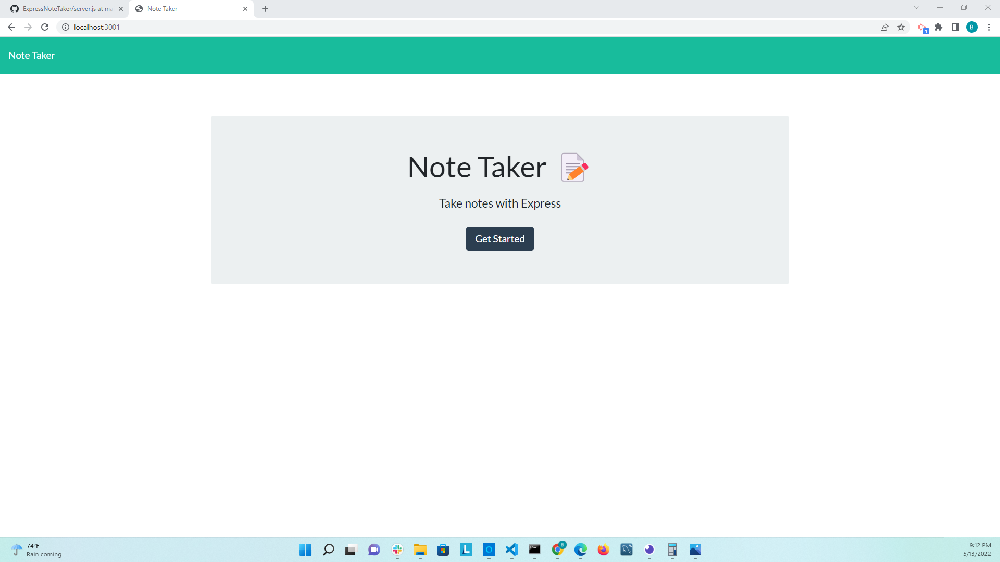
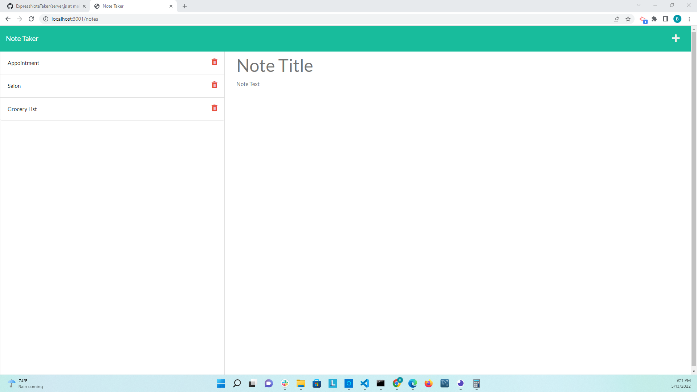

# Note-Taker
 

## Description
This is note taker application which uses express at backend to add,save,delete and retrieve data from a json file. 

## User Story

AS A small business owner
I WANT to be able to write and save notes
SO THAT I can organize my thoughts and keep track of tasks I need to complete

## Expected Behavior

* WHEN I open the Note Taker
THEN I am presented with a landing page with a link to a notes page.
* WHEN I click on the link to the notes page
THEN I am presented with a page with existing notes listed in the left-hand column, plus empty fields to enter a new note title and the note’s text in the right-hand column.
* WHEN I enter a new note title and the note’s text
THEN a Save icon appears in the navigation at the top of the page.
* WHEN I click on the Save icon
THEN the new note I have entered is saved and appears in the left-hand column with the other existing notes.
* WHEN I click on an existing note in the list in the left-hand column
THEN that note appears in the right-hand column.
* WHEN I click on the Write icon in the navigation at the top of the page
THEN I am presented with empty fields to enter a new note title and the note’s text in the right-hand column.

## Usage

* Clone this repository to use this application on local machine.

* To install necessary dependencies, run npm install in the terminal.

* The application will be invoked with  node server.js. This will start localhost server on PORT 3000.

* Open browser and type `http://localhost:3000/` to run this application on your local machine.

## Screenshots

## Deployed Application on Heroku

## Github

https://github.com/bhavnao/Note-Taker
